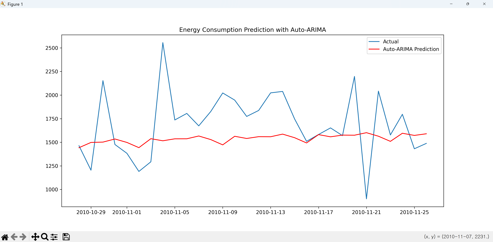
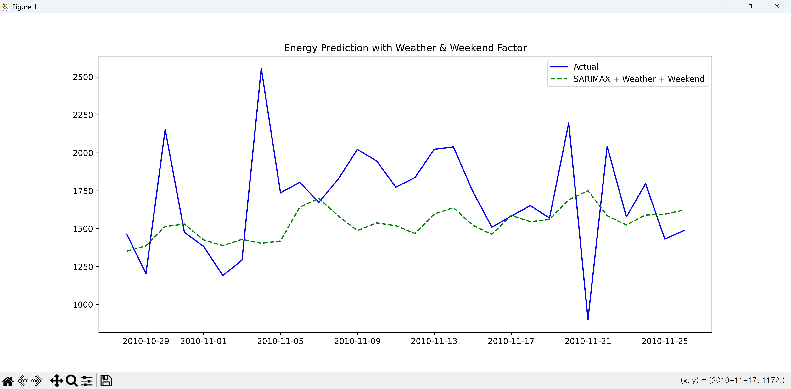
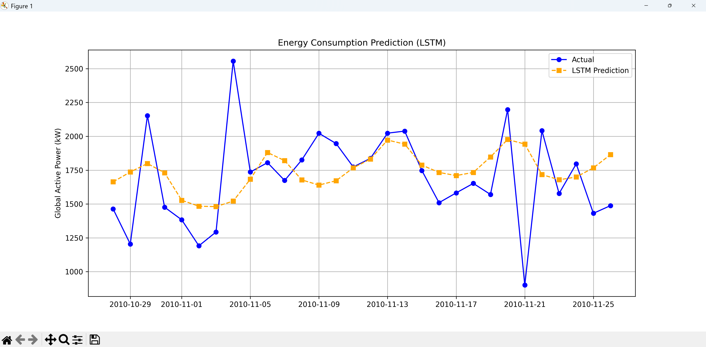
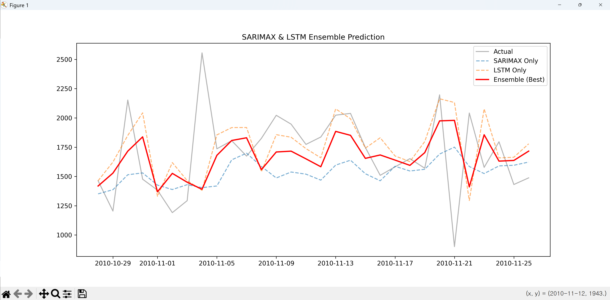

# Household 에너지 사용량 예측(day5/step2 폴더 참조)

가정용 에너지 사용량 예측 프로젝트는 데이터 분석과 머신러닝의 기초, 시계열 데이터의 특성을 이해하고, 전력 소비 패턴을 분석하는 과정을 단계별로 예제 중심으로 알아 보겠습니다.

---

## 1. 데이터셋 준비 (Dataset)

* **추천 데이터:** [UCI Machine Learning Repository - Individual household electric power consumption](https://archive.ics.uci.edu/ml/datasets/individual+household+electric+power+consumption)
* **특징:** 프랑스 파리 주변 7Km의 한 가구 내에서 47개월 동안 1분 단위로 측정된 전력 소비량 데이터입니다.
* **주요 변수:** 전압(Voltage), 전류(Global_intensity), 가전제품별 전력(Sub_metering 1, 2, 3) 등.

|변수 이름|역할|유형|설명|단위|누락된 값|
|---|---|---|---|---|---|
|Date|특징|날짜|날짜|아니요|
|Time|특징|Categorical|시간| |아니요|
|Global_active_power|특징|Continuous|유효 전력| |아니요|
|Global_reactive_power|특징|Continuous|무효 전력| |아니요|
|Voltage|특징|Continuous|전압| |아니요|
|Global_intensity|특징|Continuous|총 전류 세기|아니요|
|Sub_metering_1|특징|Continuous|주방| |아니요|
|Sub_metering_2|특징|Continuous|세탁실| |아니요|
|Sub_metering_3특징|Continuous|냉난방| |아니요|

---

## 2. 프로젝트 파이프라인

에너지 예측 프로젝트는 아래의 흐름으로 진행됩니다.

1. **데이터 전처리:** 결측치 처리, 날짜/시간 데이터 변환.
2. **특성 공학(Feature Engineering):** 시간대(오전/오후), 요일(주말 여부), 계절성 변수 생성.
3. **모델링:** ARIMA 모델링 또는 시계열 모델(LSTM)
4. **예측:** 1달 후 예측.

---

## 3. Python 실전 코드 예제

### 1. 데이터 다운로드

[UCI Machine Learning Repository - Individual household electric power consumption](https://archive.ics.uci.edu/ml/datasets/individual+household+electric+power+consumption)
에서 압축된 자료를 다운받아 ./data 폴더에 압축을 푸세요.

### 2. 데이터 전처리

UCI 데이터셋은 1분 단위로 기록된 매우 방대한 데이터(약 200만 행)이므로, 이를 효율적으로 읽어와서 일단위(Daily)로 요약(Resampling)하는 과정이 프로젝트의 첫 단추입니다.

특히 메모리 절약과 결측치 처리에 유의하여 코드를 작성했습니다.

작업순서

1. 데이터 읽기
2. 날짜와 시간 컬럼을 합침
3. 인덱스 설정 및 불필요한 컬럼 삭제
4. 결측치 처리 및 숫자형 변환
5. 일단위 재샘플링
6. 결과 확인 및 저장

파일명 : day5/step2/household_resample.py

```python
import pandas as pd
import numpy as np

# 1. 데이터 읽기
# - sep=';' : 데이터가 세미콜론으로 구분되어 있음
# - low_memory=False : 데이터 타입 추론 시 메모리 절약 모드 비활성화
# - na_values=['?'] : 데이터 중 '?'로 표시된 결측치를 NaN으로 인식
file_path = './data/household_power_consumption.txt'

print("데이터를 로딩 중입니다... 잠시만 기다려주세요.")

# 1. 일단 컬럼별로 읽어오기
df = pd.read_csv(file_path, sep=';', 
                 low_memory=False, 
                 na_values=['?'])

# 2. 날짜와 시간 컬럼을 합쳐서 datetime 타입으로 변환
# Date와 Time 컬럼을 합쳐서 새로운 인덱스를 만듭니다.
df['dt'] = pd.to_datetime(df['Date'] + ' ' + df['Time'], dayfirst=True)

# 3. 인덱스 설정 및 불필요한 컬럼 삭제
df.set_index('dt', inplace=True)
df.drop(['Date', 'Time'], axis=1, inplace=True)

# 4. 결측치 처리 및 숫자형 변환
df = df.ffill().astype(float)

# 5. 일단위 재샘플링 (Resampling)
# 'D'는 Day를 의미하며, 하루 동안의 합계(sum)를 구함
# 만약 하루 평균 사용량을 알고 싶다면 .mean()을 사용하세요.
df_daily = df.resample('D').sum()

# 6. 결과 확인
print("\n--- 재샘플링 완료 ---")
print(df_daily.head())
print(f"\n데이터 크기 변환: {df.shape[0]} 행 -> {df_daily.shape[0]} 행")

# 7. 저장 
df_daily.to_csv('./data/household_daily_usage.csv')
```

SARIMA 모델 적용하여 학습하여 최종 30일 이전 자료와 비교

파일명 : day5/step2/household1.py

```python
import pandas as pd
import numpy as np
import matplotlib.pyplot as plt
from statsmodels.tsa.seasonal import seasonal_decompose
from pmdarima import auto_arima

file_path = './data/household_daily_usage.csv'
# 1. 일단 컬럼별로 읽어오기
df = pd.read_csv(file_path, parse_dates=['dt'], index_col='dt')

# 2. 데이터 분해 (seasonal_decompose)
# 데이터의 구성 요소: Trend(추세), Seasonal(계절성), Resid(잔차) 확인
print("데이터 분해를 시작합니다...")
result = seasonal_decompose(df['Global_active_power'], model='additive', period=7) # 주간 주기(7일) 가정

result.plot()
plt.show()

# 3. 최적의 ARIMA 파라미터 찾기 (auto_arima)
# p, d, q를 수동으로 정하지 않고 모델이 데이터에 맞춰 최적값을 찾습니다.
print("최적의 ARIMA 파라미터를 찾는 중입니다 (시간이 다소 소요될 수 있습니다)...")
stepwise_model = auto_arima(df['Global_active_power'], 
                            m=7,                # 주간 계절성 반영
                            seasonal=True,      # SARIMA 사용
                            stepwise=True,      # 최적화 속도 향상
                            trace=False         # 중간 과정 출력 생략 (더 깔끔함)
                            )

print(stepwise_model.summary())

# 4. 학습 및 미래 예측
# 마지막 30일을 테스트 데이터로 분리
train = df['Global_active_power'][:-30]
test = df['Global_active_power'][-30:]

stepwise_model.fit(train)

# 30일치 예측
future_forecast = stepwise_model.predict(n_periods=30)

# [4단계] 결과 시각화
plt.figure(figsize=(12, 6))
plt.plot(test.index, test.values, label='Actual')
plt.plot(test.index, future_forecast, label='Auto-ARIMA Prediction', color='red')
plt.title('Energy Consumption Prediction with Auto-ARIMA')
plt.legend()
plt.show()
```

실행결과



---

### 3. 특성 공학 (Feature Engineering)

인덱스(날짜)에서 요일을 추출 (5: 토요일, 6: 일요일)

```python
df['is_weekend'] = df.index.dayofweek.map(lambda x: 1 if x >= 5 else 0)
```

## 4. 프로젝트 고도화 팁

단순히 "에너지를 많이 쓴다"를 맞히는 것보다, **"왜 많이 썼는가"** 를 분석하는 것이 실제 서비스에선 더 중요합니다.

* **외부 데이터 결합:** 기상청 API를 통해 '불쾌지수'나 '폭염주의보' 데이터를 결합해서 학습을 시킬 수 있습니다.
* **지연 변수(Lag Features):** "어제의 사용량"은 "오늘의 사용량"을 예측하는 데 가장 강력한 힌트가 됩니다. `df['target_usage'].shift(1)`을 사용해 보세요.

---
**Meteostat** 는 전 세계의 기상 관측소 데이터를 아주 쉽고 빠르게 가져올 수 있게 해주는 파이썬 라이브러리입니다. 우리가 앞서 `./data/paris_weather_data.csv` 파일을 직접 로딩했던 작업을, 이 패키지를 사용하면 **코드 몇 줄로 전 세계 어디든 실시간으로 데이터를 긁어오는 작업**으로 바꿀 수 있습니다.

데이터 과학자들이 기상 데이터를 다룰 때 가장 선호하는 라이브러리 중 하나입니다.

---

## 5. Meteostat을 이용하여 기상정보 얻기

**Meteostat** 는 전 세계의 기상 관측소 데이터를 누구나 쉽게 이용할 수 있도록 제공하는 오픈 소스 기상 데이터 라이브러리이자 플랫폼입니다.

* **방대한 데이터 소스:** NOAA(미국 해양대기청), 독일 기상청 등 공신력 있는 기관의 데이터를 통합하여 제공합니다.
* **유연한 시간 단위:** **시간 단위(Hourly)**, **일 단위(Daily)**, **월 단위(Monthly)** 데이터를 모두 지원합니다.
* **자동 보간:** 특정 관측소에 데이터가 비어 있으면 인근 관측소의 데이터를 활용해 자동으로 채워주는 기능이 강력합니다.
* **Pandas 친화적:** 데이터를 가져오면 즉시 `Pandas DataFrame` 형태로 반환됩니다

파일명 : day5/step2/paris_weather.py

```python
from datetime import datetime
from meteostat import daily

# 파리의 기상 데이터를 불러오는 예제 코드입니다.

# 1. 기간 설정 (2006-12-01 ~ 2010-11-26)
start = datetime(2006, 12, 16)
end = datetime(2010, 11, 26)

# 2. 일 단위 데이터 불러오기
# 관측소 ID를 직접 사용하여 데이터 호출 (07149는 파리 오를리 공항)
data = daily('07149', start, end)
data = data.fetch()

# 3. 결과 확인 (기온, 강수량 등)
print(data.head())

data.to_csv('./data/paris_weather_data.csv')
```

### 제공되는 주요 컬럼 정보

| 컬럼명 | 한글 설명 | 단위 | 에너지 예측 시 활용 팁 |
| --- | --- | --- | --- |
| **time** | 관측 시간 | 일/시 | 주기성(시간대, 요일, 계절)을 파악하는 기준점입니다. |
| **temp** | 평균 기온 | °C | **가장 중요.** 냉/난방 전력 사용량과 직결됩니다. |
| **tmin** | 최저 기온 | °C | 야간 및 새벽 시간대의 난방 수요를 예측할 때 쓰입니다. |
| **tmax** | 최고 기온 | °C | 낮 시간대 폭염으로 인한 에어컨 사용 급증을 예측합니다. |
| **rhum** | 상대 습도 | % | 기온과 결합하여 **불쾌지수**를 계산할 때 필수입니다. |
| **prcp** | 강수량 | mm | 비가 오면 외부 활동이 줄어 가전제품 사용량이 늘 수 있습니다. |
| **snwd** | 적설량 | mm | 폭설 시 외부 활동 제한 및 난방 수요 폭증의 지표가 됩니다. |
| **wspd** | 평균 풍속 | km/h | 바람이 강하면 체감 온도가 낮아져 난방 부하가 커질 수 있습니다. |
| **wpgt** | 최대 순간 풍속 | km/h | 이상 기후나 태풍 등의 특이 케이스 분석에 활용됩니다. |
| **pres** | 해면 기압 | hPa | 기압 변화는 날씨 변화의 전조 증상으로 활용됩니다. |
| **tsun** | 일조 시간 | 분(min) | 태양광 발전량이 있는 가구의 경우 순 전력 수요에 영향을 줍니다. |
| **cldc** | 클라우드 커버 (운량) | % | 구름이 많으면 일사량이 줄어 낮 시간 조명 사용량이 늘 수 있습니다. |

## 6. 기상정보와 에너지 사용량 데이터 결합

1. 데이터 로딩

```bash
# 에너지 사용량 데이터 읽기
df_energy = pd.read_csv('./data/household_daily_usage.csv', parse_dates=['dt'], index_col='dt')
# 기상정보 데이터 읽기
df_weather = pd.read_csv('./data/paris_weather_data.csv', parse_dates=['time'], index_col='time')
```

2. 데이터 병합

```bash
# 데이터 병합
df = df_energy.join(df_weather, how='inner')
```

3. 기상정보와 에너지 사용량 데이터 결합하여 SARIMAX 모델 학습

파일명 : day5/step2/household2_weater.py

```python
import pandas as pd
import numpy as np
import matplotlib.pyplot as plt
from pmdarima import auto_arima

# [1] 데이터 로딩 (기존과 동일)
df_energy = pd.read_csv('./data/household_daily_usage.csv', parse_dates=['dt'], index_col='dt')
df_weather = pd.read_csv('./data/paris_weather_data.csv', parse_dates=['time'], index_col='time')

# [2] 날씨 데이터 전처리 + 평균온도 계산
weather_cols = ['tmin', 'tmax', 'prcp']
df_weather = df_weather[weather_cols].copy()
df_weather['temp_est'] = (df_weather['tmin'] + df_weather['tmax']) / 2
df_weather = df_weather.interpolate().ffill().bfill()

# [3] 데이터 병합
df = df_energy.join(df_weather, how='inner')

# [4] 주말 여부(is_weekend) 변수 추가 (핵심!)
# 인덱스(날짜)에서 요일을 추출 (5: 토요일, 6: 일요일)
df['is_weekend'] = df.index.dayofweek.map(lambda x: 1 if x >= 5 else 0)

# [5] 분석 데이터 준비
y = df['Global_active_power']
# 외생 변수에 주말 여부 추가
X = df[['temp_est', 'tmin', 'tmax', 'prcp', 'is_weekend']]

# 훈련/테스트 분리
train_y, test_y = y[:-30], y[-30:]
train_X, test_X = X[:-30], X[-30:]

# [6] SARIMAX 모델 학습
print("날씨와 주말 정보를 모두 포함하여 최적의 모델을 찾습니다...")
stepwise_model = auto_arima(train_y, 
                            X=train_X, 
                            m=7, 
                            seasonal=True, 
                            stepwise=True, 
                            trace=True)

# [7] 예측 및 시각화
future_forecast = stepwise_model.predict(n_periods=30, X=test_X)

plt.figure(figsize=(12, 6))
plt.plot(test_y.index, test_y.values, label='Actual', color='blue')
plt.plot(test_y.index, future_forecast, label='SARIMAX + Weather + Weekend', color='green', linestyle='--')
plt.title('Energy Prediction with Weather & Weekend Factor')
plt.legend()
plt.show()
```

실행결과


4. LSTM 모델 학습

파일명 : day5/step2/household3_lstm.py

```python
import pandas as pd
import numpy as np
import matplotlib.pyplot as plt
from sklearn.preprocessing import MinMaxScaler
from tensorflow.keras.models import Sequential
from tensorflow.keras.layers import LSTM, Dense, Dropout
from tensorflow.keras.callbacks import EarlyStopping

# 1. 데이터 로드 및 병합 (기존 로직 유지)
df_energy = pd.read_csv(r'.\data\household_daily_usage.csv', parse_dates=['dt'], index_col='dt')
df_weather = pd.read_csv(r'.\data\paris_weather_data.csv', parse_dates=['time'], index_col='time')

# 날씨 전처리 및 주말 변수 생성
df_weather['temp_est'] = (df_weather['tmin'] + df_weather['tmax']) / 2
df_weather = df_weather[['temp_est', 'tmin', 'tmax', 'prcp']].interpolate().ffill().bfill()
df = df_energy.join(df_weather, how='inner')
df['is_weekend'] = df.index.dayofweek.map(lambda x: 1 if x >= 5 else 0)

# 2. 학습에 사용할 특성(Features) 선택
# 타겟인 Global_active_power를 가장 앞에 두어 나중에 역스케일링을 편하게 합니다.
features = ['Global_active_power', 'temp_est', 'tmin', 'tmax', 'prcp', 'is_weekend']
dataset = df[features].values

# 3. 데이터 스케일링 (LSTM은 0~1 사이 값에서 가장 성능이 좋음)
scaler = MinMaxScaler(feature_range=(0, 1))
scaled_data = scaler.fit_transform(dataset)

# 4. 시계열 데이터셋 생성 함수 (Window Sliding)
def create_sequences(data, seq_length):
    X, y = [], []
    for i in range(len(data) - seq_length):
        X.append(data[i:i+seq_length, :]) # 과거 seq_length일 동안의 모든 특성
        y.append(data[i+seq_length, 0])    # 다음 날의 Global_active_power (타겟)
    return np.array(X), np.array(y)

seq_length = 7 # 일주일치 데이터를 보고 다음날 예측
X, y = create_sequences(scaled_data, seq_length)

# 5. 학습/테스트 데이터 분리 (마지막 30일 테스트)
train_size = len(X) - 30
X_train, X_test = X[:train_size], X[train_size:]
y_train, y_test = y[:train_size], y[train_size:]

# 6. LSTM 모델 설계
model = Sequential([
    LSTM(128, return_sequences=True, input_shape=(X_train.shape[1], X_train.shape[2])),
    Dropout(0.2),
    LSTM(64, return_sequences=False),
    Dropout(0.2),
    Dense(1) # 최종 출력: 다음날 전력 사용량 1개
])

model.compile(optimizer='adam', loss='mse')

# 조기 종료 설정 (과적합 방지)
early_stop = EarlyStopping(monitor='val_loss', patience=5)

# 7. 모델 학습
print("LSTM 모델 학습 시작...")
history = model.fit(X_train, y_train, epochs=50, batch_size=16, 
                    validation_split=0.1, callbacks=[early_stop], verbose=1)

# 8. 예측 및 역스케일링 (원래 단위인 kW로 복구)
predictions = model.predict(X_test)

# 역스케일링을 위해 더미 행렬 생성
predict_copies = np.zeros((len(predictions), len(features)))
predict_copies[:, 0] = predictions.flatten()
inv_predictions = scaler.inverse_transform(predict_copies)[:, 0]

actual_copies = np.zeros((len(y_test), len(features)))
actual_copies[:, 0] = y_test
inv_actual = scaler.inverse_transform(actual_copies)[:, 0]

# 9. 결과 시각화
plt.figure(figsize=(12, 6))
plt.plot(df.index[-30:], inv_actual, label='Actual', color='blue', marker='o')
plt.plot(df.index[-30:], inv_predictions, label='LSTM Prediction', color='orange', linestyle='--', marker='s')
plt.title('Energy Consumption Prediction (LSTM)')
plt.ylabel('Global Active Power (kW)')
plt.legend()
plt.grid(True)
plt.show()
```

실행결과



5. salimax와 lstm을 결합하여 예측

파일명 : day5/step2/household4_salimax_lstm.py

```python
import pandas as pd
import numpy as np
import matplotlib.pyplot as plt
from sklearn.preprocessing import MinMaxScaler
from pmdarima import auto_arima
from tensorflow.keras.models import Sequential
from tensorflow.keras.layers import LSTM, Dense, Dropout

# [1] 데이터 로드 및 전처리 (동일)
df_energy = pd.read_csv(r'.\data\household_daily_usage.csv', parse_dates=['dt'], index_col='dt')
df_weather = pd.read_csv(r'.\data\paris_weather_data.csv', parse_dates=['time'], index_col='time')

df_weather['temp_est'] = (df_weather['tmin'] + df_weather['tmax']) / 2
df_weather = df_weather[['temp_est', 'tmin', 'tmax', 'prcp']].interpolate().ffill().bfill()
df = df_energy.join(df_weather, how='inner')
df['is_weekend'] = df.index.dayofweek.map(lambda x: 1 if x >= 5 else 0)

# [2] 공통 데이터 분리 (마지막 30일 테스트)
y = df['Global_active_power']
X_vars = df[['temp_est', 'tmin', 'tmax', 'prcp', 'is_weekend']]

train_y, test_y = y[:-30], y[-30:]
train_X, test_X = X_vars[:-30], X_vars[-30:]

# --- [3] 모델 1: SARIMAX 학습 및 예측 ---
print("SARIMAX 학습 중...")
sarima_model = auto_arima(train_y, X=train_X, m=7, seasonal=True, stepwise=True)
sarima_pred = sarima_model.predict(n_periods=30, X=test_X)

# --- [4] 모델 2: LSTM 학습 및 예측 ---
print("LSTM 학습 중...")
# LSTM용 스케일링
scaler = MinMaxScaler()
scaled_data = scaler.fit_transform(df[['Global_active_power', 'temp_est', 'tmin', 'tmax', 'prcp', 'is_weekend']])

def create_sequences(data, seq_length):
    X, target = [], []
    for i in range(len(data) - seq_length):
        X.append(data[i:i+seq_length, :])
        target.append(data[i+seq_length, 0])
    return np.array(X), np.array(target)

seq_length = 7
X_seq, y_seq = create_sequences(scaled_data, seq_length)

# 테스트 데이터 구간 분리 (y_seq의 마지막 30개가 test_y와 일치함)
X_train_lstm = X_seq[:-30]
y_train_lstm = y_seq[:-30]
X_test_lstm = X_seq[-30:]

lstm_model = Sequential([
    LSTM(128, return_sequences=True, input_shape=(seq_length, X_seq.shape[2])),
    Dropout(0.2),
    LSTM(64, return_sequences=False),
    Dense(1)
])
lstm_model.compile(optimizer='adam', loss='mse')
lstm_model.fit(X_train_lstm, y_train_lstm, epochs=50, batch_size=16, verbose=0)

# LSTM 예측 및 역스케일링
lstm_raw_pred = lstm_model.predict(X_test_lstm)
dummy = np.zeros((30, 6))
dummy[:, 0] = lstm_raw_pred.flatten()
lstm_pred = scaler.inverse_transform(dummy)[:, 0]

# --- [5] 결과 결합 (Ensemble) ---
# 두 모델의 예측값을 5:5로 섞음 (가중치는 조절 가능)
ensemble_pred = (sarima_pred.values * 0.4) + (lstm_pred * 0.6)

# [6] 최종 시각화
plt.figure(figsize=(12, 6))
plt.plot(test_y.index, test_y.values, label='Actual', color='black', alpha=0.3)
plt.plot(test_y.index, sarima_pred, label='SARIMAX Only', linestyle='--', alpha=0.6)
plt.plot(test_y.index, lstm_pred, label='LSTM Only', linestyle='--', alpha=0.6)
plt.plot(test_y.index, ensemble_pred, label='Ensemble (Best)', color='red', linewidth=2)
plt.title('SARIMAX & LSTM Ensemble Prediction')
plt.legend()
plt.show()

# 오차 확인 (RMSE)
from sklearn.metrics import mean_squared_error
print(f"SARIMAX RMSE: {np.sqrt(mean_squared_error(test_y, sarima_pred)):.2f}")
print(f"LSTM RMSE: {np.sqrt(mean_squared_error(test_y, lstm_pred)):.2f}")
print(f"Ensemble RMSE: {np.sqrt(mean_squared_error(test_y, ensemble_pred)):.2f}")
```

실행결과



6. 예측을 하기 위해 학습하고 모델 저장하기

파일명 : day5/step2/household5_training.py.py

```python

import pandas as pd
import numpy as np
import matplotlib.pyplot as plt
from sklearn.preprocessing import MinMaxScaler
from pmdarima import auto_arima
from tensorflow.keras.models import Sequential
from tensorflow.keras.layers import LSTM, Dense, Dropout
import joblib


# [1] 데이터 로드 및 전처리 (동일)
df_energy = pd.read_csv(r'.\data\household_daily_usage.csv', parse_dates=['dt'], index_col='dt')
df_weather = pd.read_csv(r'.\data\paris_weather_data.csv', parse_dates=['time'], index_col='time')

df_weather['temp_est'] = (df_weather['tmin'] + df_weather['tmax']) / 2
df_weather = df_weather[['temp_est', 'tmin', 'tmax', 'prcp']].interpolate().ffill().bfill()
df = df_energy.join(df_weather, how='inner')
df['is_weekend'] = df.index.dayofweek.map(lambda x: 1 if x >= 5 else 0)

# [2] 공통 데이터 분리 (마지막 30일 테스트)
y = df['Global_active_power']
X_vars = df[['temp_est', 'tmin', 'tmax', 'prcp', 'is_weekend']]

train_y, test_y = y[:-30], y[-30:]
train_X, test_X = X_vars[:-30], X_vars[-30:]

# --- [3] 모델 1: SARIMAX 학습 및 예측 ---
print("SARIMAX 학습 중...")
sarima_model = auto_arima(train_y, X=train_X, m=7, seasonal=True, stepwise=True)
sarima_pred = sarima_model.predict(n_periods=30, X=test_X)

# --- [4] 모델 2: LSTM 학습 및 예측 ---
print("LSTM 학습 중...")
# LSTM용 스케일링
scaler = MinMaxScaler()
scaled_data = scaler.fit_transform(df[['Global_active_power', 'temp_est', 'tmin', 'tmax', 'prcp', 'is_weekend']])

def create_sequences(data, seq_length):
    X, target = [], []
    for i in range(len(data) - seq_length):
        X.append(data[i:i+seq_length, :])
        target.append(data[i+seq_length, 0])
    return np.array(X), np.array(target)

seq_length = 7
X_seq, y_seq = create_sequences(scaled_data, seq_length)

# 테스트 데이터 구간 분리 (y_seq의 마지막 30개가 test_y와 일치함)
X_train_lstm = X_seq[:-30]
y_train_lstm = y_seq[:-30]
X_test_lstm = X_seq[-30:]

lstm_model = Sequential([
    LSTM(128, return_sequences=True, input_shape=(seq_length, X_seq.shape[2])),
    Dropout(0.2),
    LSTM(64, return_sequences=False),
    Dense(1)
])
lstm_model.compile(optimizer='adam', loss='mse')
lstm_model.fit(X_train_lstm, y_train_lstm, epochs=50, batch_size=16, verbose=0)

# LSTM 예측 및 역스케일링
lstm_raw_pred = lstm_model.predict(X_test_lstm)
dummy = np.zeros((30, 6))
dummy[:, 0] = lstm_raw_pred.flatten()
lstm_pred = scaler.inverse_transform(dummy)[:, 0]

# --- [5] 결과 결합 (Ensemble) ---
# 두 모델의 예측값을 5:5로 섞음 (가중치는 조절 가능)
ensemble_pred = (sarima_pred.values * 0.4) + (lstm_pred * 0.6)

# [6] 최종 시각화
plt.figure(figsize=(12, 6))
plt.plot(test_y.index, test_y.values, label='Actual', color='black', alpha=0.3)
plt.plot(test_y.index, sarima_pred, label='SARIMAX Only', linestyle='--', alpha=0.6)
plt.plot(test_y.index, lstm_pred, label='LSTM Only', linestyle='--', alpha=0.6)
plt.plot(test_y.index, ensemble_pred, label='Ensemble (Best)', color='red', linewidth=2)
plt.title('SARIMAX & LSTM Ensemble Prediction')
plt.legend()
plt.show()

# 오차 확인 (RMSE)
from sklearn.metrics import mean_squared_error
print(f"SARIMAX RMSE: {np.sqrt(mean_squared_error(test_y, sarima_pred)):.2f}")
print(f"LSTM RMSE: {np.sqrt(mean_squared_error(test_y, lstm_pred)):.2f}")
print(f"Ensemble RMSE: {np.sqrt(mean_squared_error(test_y, ensemble_pred)):.2f}")

# [7] 모델 및 스케일러 저장
# 1. SARIMAX 모델 저장 (통계 모델은 .pkl 확장자를 주로 사용)
joblib.dump(sarima_model, './model/sarima_final.pkl')

# 2. LSTM 모델 저장 (딥러닝 모델은 .h5 또는 .keras 확장자 사용)
lstm_model.save('./model/lstm_final.h5')

# 3. 스케일러 저장 (매우 중요!)
# 예측 시 새로운 데이터를 0~1 사이로 바꿀 때 학습 때 쓴 기준이 필요합니다.
joblib.dump(scaler, './model/scaler.pkl')

print("모든 모델과 스케일러가 성공적으로 저장되었습니다.")

```

7. inference를 위한 코드

파일명 : household6_inference.py

```python
import pandas as pd
import numpy as np
import joblib
from tensorflow.keras.models import load_model

# 1. 저장된 모델 및 스케일러 로딩
print("모델을 불러오는 중입니다...")
sarima_model = joblib.load('./model/sarima_final.pkl')
lstm_model = load_model('./model/lstm_final.h5', compile=False) 
scaler = joblib.load('./model/scaler.pkl')

# 2. 미래 7일 데이터 준비
weather_path = '.\data\paris_weather_data.csv'
df_weather = pd.read_csv(weather_path, parse_dates=['time'], index_col='time')
df_weather['temp_est'] = (df_weather['tmin'] + df_weather['tmax']) / 2
df_weather = df_weather[['temp_est', 'tmin', 'tmax', 'prcp']].interpolate().ffill().bfill()

future_X = df_weather.iloc[-7:].copy()
future_X['is_weekend'] = future_X.index.dayofweek.map(lambda x: 1 if x >= 5 else 0)

# 3. SARIMAX 예측
sarima_forecast = sarima_model.predict(n_periods=7, X=future_X)

# 4. LSTM 예측
# 입력 데이터 구성 (전력, 온도_평균, 최저, 최고, 강수, 주말여부) - 6개 컬럼
# 실제 데이터가 없는 미래 시점이므로, 날씨 정보만 활용하여 예측 루프를 돕니다.
lstm_predictions = []

# 가장 최근의 7일치 데이터를 기반으로 입력 구성 (6개 컬럼 shape 맞춰야 함)
# 여기서는 시연을 위해 0으로 채운 뒤 날씨만 업데이트
test_input_raw = np.zeros((7, 6))
test_input_raw[:, 1:] = future_X.values
current_input_scaled = scaler.transform(test_input_raw) # (7, 6)
current_input_scaled = current_input_scaled.reshape(1, 7, 6) # (1, 7, 6)

for i in range(7):
    # 예측 수행
    lstm_scaled_pred = lstm_model.predict(current_input_scaled, verbose=0)
    
    # [에러 해결 포인트] 예측값에서 단일 스칼라 값 추출
    pred_val = lstm_scaled_pred.flatten()[0]
    
    # 역스케일링을 위해 더미 생성
    dummy_output = np.zeros((1, 6))
    dummy_output[0, 0] = pred_val # 이제 에러 없이 들어갑니다.
    inv_pred = scaler.inverse_transform(dummy_output)[0, 0]
    lstm_predictions.append(inv_pred)
    
    # 다음 날 예측을 위한 입력 업데이트 (윈도우 이동)
    new_row = np.zeros((1, 1, 6))
    new_row[0, 0, 0] = pred_val # 예측된 전력을 다음 입력의 전력값으로 사용
    if i < 6: # 마지막 루프가 아니면 날씨 정보 업데이트
        # 다음 날의 스케일링된 날씨 정보 가져오기 (미리 스케일링해둔 값 사용)
        next_weather_scaled = scaler.transform(test_input_raw)[i+1, 1:]
        new_row[0, 0, 1:] = next_weather_scaled
        
    current_input_scaled = np.append(current_input_scaled[:, 1:, :], new_row, axis=1)

# 5. 결과 출력
print("\n" + "="*40)
print(f"{'날짜':<12} | {'예측 사용량(kW)':<15}")
print("-" * 40)

for i in range(7):
    # SARIMA(4) + LSTM(6) 앙상블
    ensemble_val = (sarima_forecast.values[i] * 0.4) + (lstm_predictions[i] * 0.6)
    target_date = future_X.index[i].strftime('%Y-%m-%d')
    weekend = " (주말)" if future_X['is_weekend'].iloc[i] == 1 else ""
    print(f"{target_date}{weekend:<5} | {ensemble_val:>12.2f}")

print("="*40)
```
